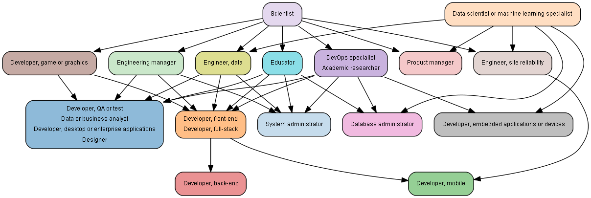
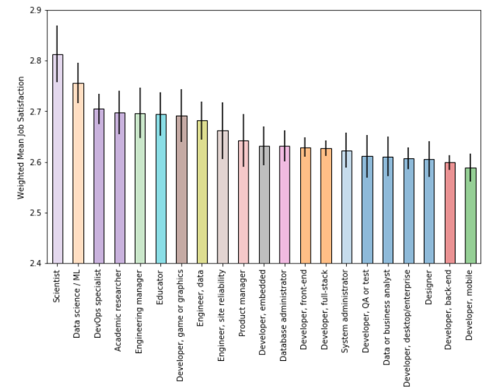
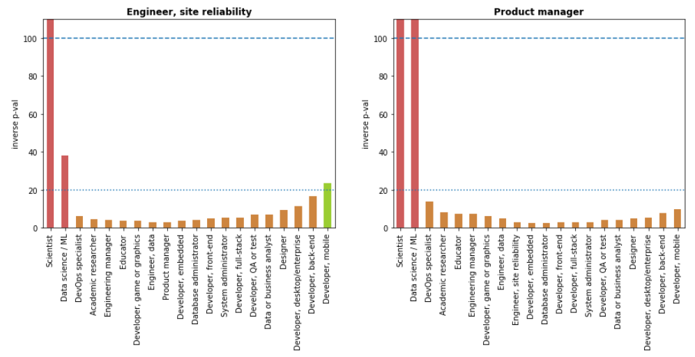

# SO_survey_dev_satisfaction

## Installation

To run this code:

- Install the Anaconda distribution of Python 3.
- There are additional dependencies available via pip, so I recommend creating a new conda environment to make these pip installations and run these notebooks:
  - `conda create --name so_dev_satisfaction`
- Install pydotplus (graphviz graph visualization)
  - `pip install pydotplus`
  - On Windows, 
- Install CatBoost machine learning library and (optionally) SHAP for model explanation:
  - `pip install catboost shap`

## Project Description

This project explores job satisfaction among different developer types, using data from Stack Overflow 2020 survey. This project has **two main purposes**.

**First**, to explore the impact of software developer role types on job satisfaction. This exploration was guided by these questions:

1. What is the magnitude of the effect of developer role types on job satisfaction compared to other factors?
2. How do developer roles compare to one another in the job satisfaction reported in the survey?
3. Are the reported differences in job satisfaction among developer roles statistically significant?

**Second**, to explore novel visualizations to allow end users to make their own comparisons of the mean satisfaction among the subsets of developer type type categories that they choose. This addresses a common problem, as noted in the 1993 paper by Goldstein and Healy [1]:

> When a study produces estimates for many units or categories a common problem is that
> end-users will wish to make their own comparisons among a subset of these units. 

The added visualizations include a  significance relation digraph paired to a bar chart:

	

and a p-value comparison plot:

## File Descriptions

- `Predict JobSat.ipynb` Creating a regression model to assess the magnitude of the effect of developer role types on job satisfaction.
- `DevType Comparison.ipynb` Comparisons of job satisfaction among developer type roles.

## Results

The main findings of the code can be found at the post available [here](https://medium.com/@rick.froom/software-developers-who-has-it-better-3dfc4646e207).

[1] Harvey Goldstein and Michael J. R. Healy, "The Graphical Presentation of a Collection of Means," Journal of the Royal Statistical Society. Series A (Statistics in Society) Vol. 158, No. 1 (1995), pp. 175-177. https://www.jstor.com/stable/2983411

